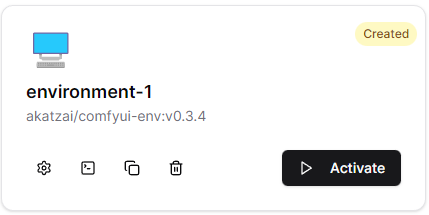
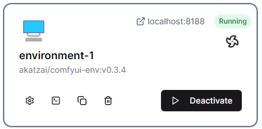
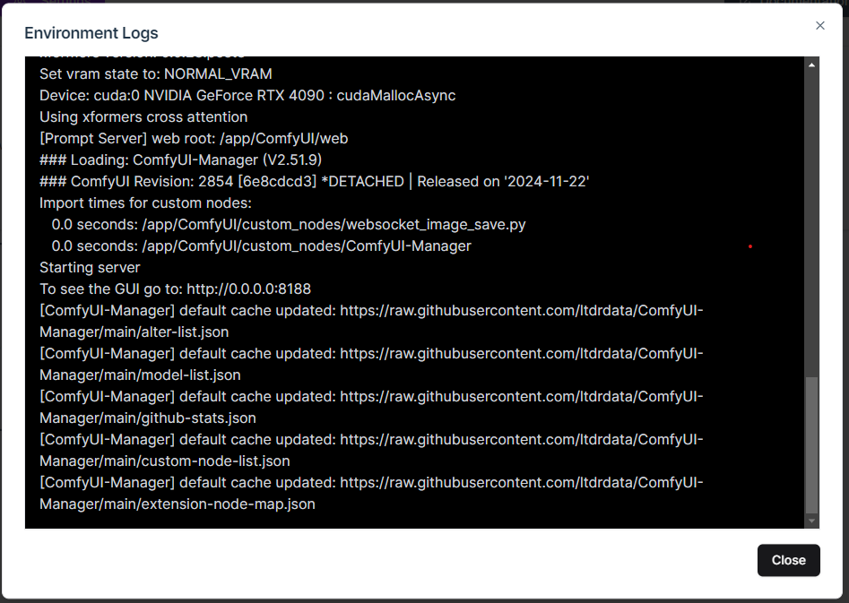
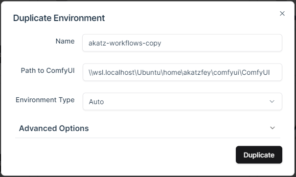
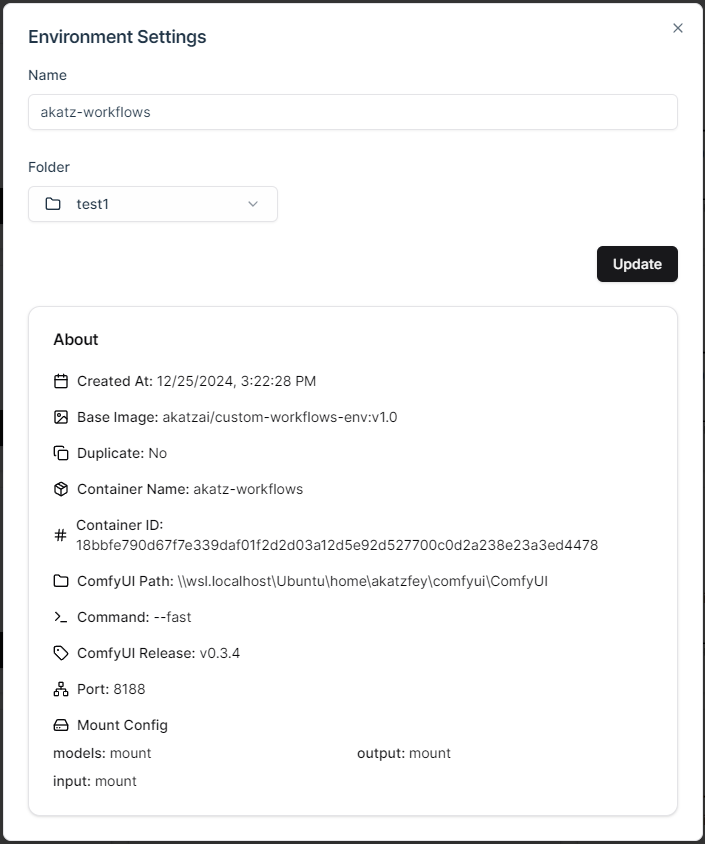
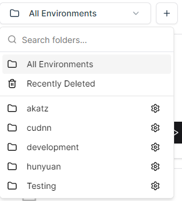
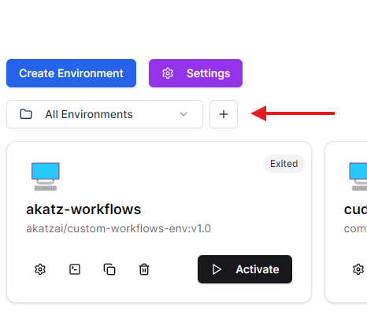
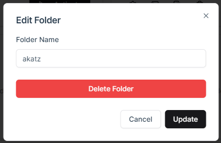
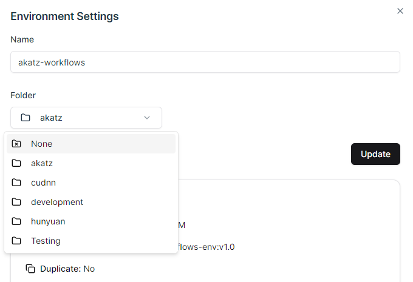

# Working with Environments

## Environment Cards

Each environment is displayed as a card, showing:

- Name
- Base image
- Status (e.g., Created, Running, Exited)

### **Actions**

- **Settings:** Edit environment details.
- **Logs:** View the current state of the environment.
- **Duplicate:** Clone an existing environment.
- **Delete:** Permanently remove an environment.
- **Activate:** Start the environment (deactivates others unless multiple containers are allowed).

---

## Activating Environments

- **Activate:** Click the **Activate** button to run the environment.
    - You will know an environment is active if it has a green **Running** status, and spinning fan icon.
    
    
    
    - Access the server by clicking the link next to the **Status** indicator.
    - Once an environment is running you will be able to monitor the internal ComfyUI logs by clicking on the “Logs” button, which open a dialog displaying the current state:
        
    

---

## Duplicating an Environment

> **Demo**
> <video controls>
> <source src="../assets/dupEnv_edit1.mp4" type="video/mp4">
> </video>

You can use the duplicate functionality to create a copy of an environment. Mounted directories are **not included** in this copy, only installed dependencies, copied data, and files already present in the environment will be saved to the duplicate.

- **Duplicate:** Use the **Duplicate** button to create a copy of an environment. Adjust settings as needed during duplication.
    
    
    
- Environment type by default is set to “Auto”, which keeps the same mount config as the original:
    
    
    
- You can further adjust the duplicate environment in the Advanced Options tab, these options are the same as when creating a new environment.

>
> **IMPORTANT:** you can only duplicate an environment that has been activated at least once.
>

---

## Deleting an Environment

- Use the **Delete** button to remove an environment.
- If the environment is **NOT** already in the “Recently Deleted” folder, it will be moved there. If it already is in the “Recently Deleted” folder, it will be permanently deleted.

> **NOTE:** Files and directories that are “mounted” from the host machine (such as models, workflows, etc.) will **NOT be deleted** when an environment is deleted. Only files native to the container or copied into the container will be deleted.

---

## Environment Settings

Click on **Settings** in the environment card to:

- Rename the environment.
- Change the environment’s folder location.
- View detailed environment information (e.g., base image, mount points).

---

## Organizing Environments with Folders

You can use folders to organize your environments. You can see which folder you are currently viewing via the dropdown in the top-left corner:

### Default Folders

- **All Environments**:
    - A default folder that will display all environments you currently have saved, regardless of which folders they are saved under.
- **Recently Deleted**:
    - A folder which shows environments that were recently removed. If you delete an environment from this folder it will be permanently deleted from the machine.
    - Up to 10 (limit configurable in Settings) environments can remain in this folder at a time. If an environment is deleted and added to “Recently Deleted” when it is already at max capacity, the oldest created environment in the folder will be permanently deleted.

### Creating New Folders

- You can create new folders by clicking on the “Add Folder” button next to the folder dropdown menu:

- Folder names must be unique
- Folders will be added to the dropdown list in the order they were created

### Editing and Deleting Folders

- You can change a folder’s name, or delete an empty folder by clicking on the “Settings” button right of a folder name in the dropdown menu.

- Click “Update” once you’ve made changes to save them.
- Click “Delete Folder” if you’d like to delete a folder, folders can only be deleted if they contain no environments (you can move or delete existing environments until the folder is empty).

### Adding Environments to Folders

There are a couple of ways to add an environment to a folder:

1. Create the environment inside of a specific folder
    1. Environments created with a folder selected will be added to that folder by default
    2. Environments created in a Default Folder (All Environments, Recently Deleted) will have the “None” folder assigned by default.
2. Duplicate an environment inside of a specific folder:
    1. Duplicates will be added to the selected folder by default
    2. Duplicates in a Default Folder will have the “None” folder assigned.
3. Manually set the environment’s folder via Environment Settings: 

    1. You can manually specify which folder an environment should belong in with the **Folder** dropdown in settings. Click “Update” once selected to save the changes.
---

## Backing Up and Sharing via Dockerhub

For instructions, see:
[Environment Sharing Using DockerHub](https://www.notion.so/Environment-Sharing-Using-DockerHub-15bfd5b1ca3b80019981e80a8ac342dc)
