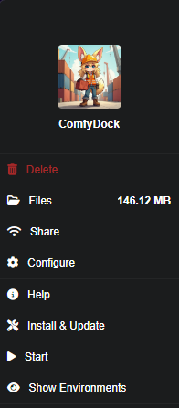

# Installation

> **Installation Demo**  
> <video controls>
> <source src="../assets/installDemo_edit1.mp4" type="video/mp4">
> </video>


## **Prerequisites**

- A **Windows** or **Linux** machine (macOS CPU-only).
- The latest version of **Pinokio** installed.
- **Docker Desktop** (or Docker Engine + NVIDIA Container Toolkit).
- Latest **WSL** (Windows only).
- Latest **NVIDIA drivers**.
- Adequate disk space.

---

## **Step 1: Install Docker Desktop**

1. Download Docker Desktop from [this link](https://www.docker.com/products/docker-desktop/). (AMD64 recommended)
2. Follow installation instructions for your operating system.
3. (Optional step: Windows) Ensure WSL is updated:
    - Open PowerShell as Administrator.
    - Run the following command:
        
        ```
        wsl --update
        ```
        
    - Verify Docker installation by running:
        
        ```
        wsl docker --version
        ```
    
    If successful, you'll see output like: `Docker version 27.3.1, build ce12230`.

---

## **Step 2: Install the Pinokio App**

1. [Download Pinokio](https://program.pinokio.computer/#/?id=install)
2. Follow the installation instructions provided on the website.
3. After installation:
    - Open Pinokio and click **Discover** (top-right corner).
    - Select **Download from URL**.
    - Enter the following URL into the first field:`https://github.com/akatz-ai/ComfyUI-Environment-Manager`Leave the second field blank.
    - Click **One-Click Install with Pinokio**.
    - Go through the standard installation process.
    - You will be prompted to download Docker Desktop (see step 1 above for instructions on installing docker), if docker is already installed you can continue.
    - Finally, click **Install** and set an appropriate name to save the application.

---

## **Step 3: Install ComfyDock**

1. Ensure Pinokio is running.
2. Click the **ComfyDock** app on the home screen.
    - You should see the following menu:
    - 
3. Click **Install & Update** to begin setup.
4. Make sure Docker Desktop is running and click **Start**.
   - Look for `Uvicorn running on http://0.0.0.0:5172`.
5. Click **Show Environments** to view the main interface.
   - If empty, wait a bit and click **refresh**.
