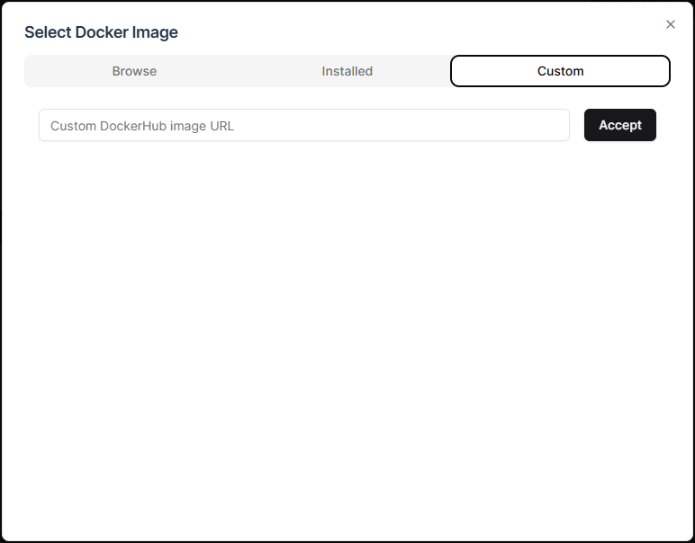

# **Environment Sharing Using DockerHub**

Sharing your ComfyUI environment via a container registry like DockerHub makes it easy for others to download and use your environment exactly as you configured it. Here’s how to do it step by step:

### **Step 1: Prepare the Environment**

1. **Create or Duplicate an Environment:**
    - Use the ComfyUI Environment Manager to create a new environment or duplicate an existing one that you want to share or back up.
2. **Install or Modify Files:**
    - Add custom nodes, models, or workflows via the Comfy Manager.
    - For more advanced edits, attach to the running container using VSCode (see the earlier guide) and make changes directly inside the container.
    
    **Important:** Only files inside the container are saved when creating an image. Files from mounted directories (e.g., your `models` folder on your host machine) will **not** be included in the image. If needed, copy these files into the container.
    

### **Step 2: Create a DockerHub Repository**

1. Log in to DockerHub at [hub.docker.com](https://hub.docker.com/)
2. Navigate to your “Repositories” page.
3. Click on **Create a repository**.
4. Name your repository (e.g., `comfy-env-test`) and set its visibility (public or private).
5. Use this name in the following tagging step.

### **Step 3: Duplicate and Tag the Environment**

1. **Duplicate the Environment:**
    - Once the environment is ready, duplicate it to generate a new image. The image will be named something like `comfy-env-clone:<environment-name>`.
2. **Locate the Image:**
    - Open Docker Desktop or use the following command to list available images:
        
        ```
        docker images
        ```
    
    - Find the `comfy-env-clone:<environment-name>` image in the list.

3. **Tag the Image for DockerHub:**
    - Use the `docker tag` command to tag the image with your DockerHub repository name:
        
        ```
        docker tag comfy-env-clone:<environment-name> <dockerhub-username>/<repo-name>:<tag>
        ```
        
        Example:
        
        ```
        docker tag comfy-env-clone:my-environment akatzai/comfy-env-test:latest
        ```
        

### **Step 4: Push the Image to DockerHub**

1. **Log in to DockerHub:**
    - Run the following command and enter your credentials:
        
        ```
        docker login
        ```
        
2. **Push the Image:**
    - Upload the tagged image to your DockerHub repository:
        
        ```
        docker push <dockerhub-username>/<repo-name>:<tag>
        ```
        
        Example:
        
        ```
        docker push akatzai/comfy-env-test:latest
        ```
        
3. **Share the Repository URL:**
    - Once the push is complete, share the repository URL (e.g., `akatzai/comfy-env-test:latest`) with others. They can now download and run the image on their machine.

---

### **Step 5: Running the Shared Environment**

1. **Download the Image:**
    - Users can download the image directly from their Environment Manager interface via the Create Environment dialog:
        
        
        
    - Users can also pull the image using the following command:
        
        ```
        docker pull <dockerhub-username>/<repo-name>:<tag>
        ```
        
        Example:
        
        ```
        docker pull akatzai/comfy-env-test:latest
        ```
        
2. **Run the Environment:**
    - If pulled via the Create Environment interface, activate the new environment and run as normal.
    - Start the container with appropriate mount settings for models, outputs, and other directories:
        
        ```
        docker run -it --rm -v /path/to/models:/app/models -v /path/to/output:/app/output <dockerhub-username>/<repo-name>:<tag>
        ```
        

---

### **Important Notes:**

- **Mounted Directories:** Ensure you know which directories to mount (e.g., `models`, `input`, `output`) for the environment to function properly.
- **Immutable Environment:** The container image is immutable, meaning you cannot change files inside it permanently unless you create a duplicate image.