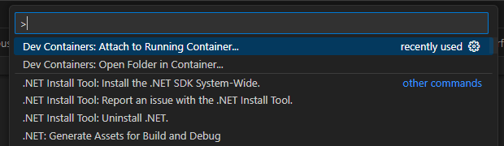
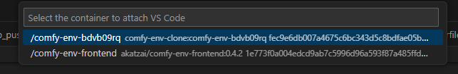
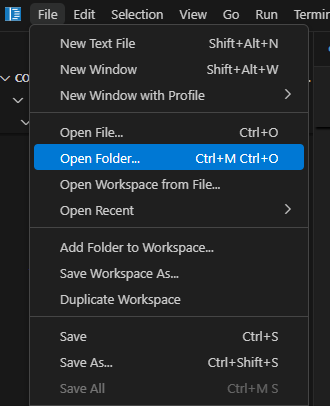
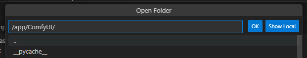
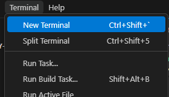
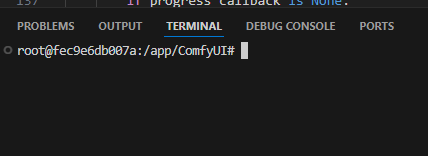

### **Editing Files Inside the Container with VSCode**

Sometimes you need to modify or update files that live solely inside the environment and aren’t mounted from your host machine (meaning you can’t just edit them from your usual file explorer).

**How to Do This Using VSCode:**

1. **Install the “Dev Containers” Extension:**
    
    In VSCode, open the Extensions panel and search for “Dev Containers”. Install it.
    
2. **Attach to the Running Container:**
    
    Make sure your environment’s container is running. In VSCode, press **F1** (or open the Command Palette) and type “Dev Containers: Attach to Running Container” and select it from menu:
    
    
    
    Select the container you want to work with: (DON’T choose /comfy-env-frontend)
    
    
    
3. **Open & Edit Files:**
    
    Once connected, VSCode will show the container’s file system. Open the “File” menu from the topbar and click “Open Folder”:
    
    
    
    
    Now you can navigate to the location of ComfyUI saved in the container by typing “/app/ComfyUI/ in the provided field:
    
    
    
    
     Click “OK”. Now in the left sidebar you should see the contents of your ComfyUI environment, and can browse folders, open files, and edit them just like you would locally. You can also drag and drop files from your machine directly into folders in the sidebar, which will upload them to the container. Any changes you make here will apply and be saved directly inside the container.
    
4. Open a Terminal to access the running python environment:
    
    You can perform actions such as “git clone” and “uv pip install” inside of the container environment by opening a new terminal window after connecting:
    
    
    
    
    You should see this terminal open at the bottom of the VSCode window:
    
    
    
    Now you can perform all your required installation actions just like you would on a local environment.
    

**Why Do This?**

- Perfect for tweaking custom nodes, environment configs, or any code that isn’t easily accessible from your host machine.
- Great for development and troubleshooting without having to rebuild or re-mount anything.