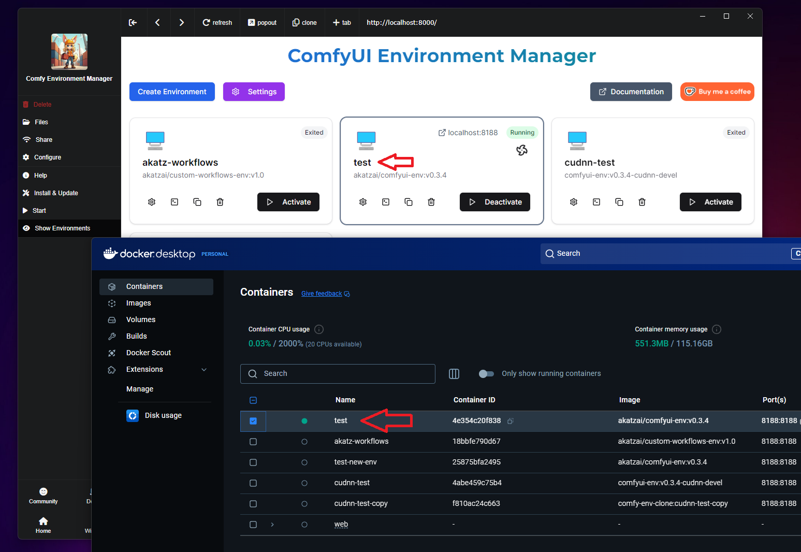
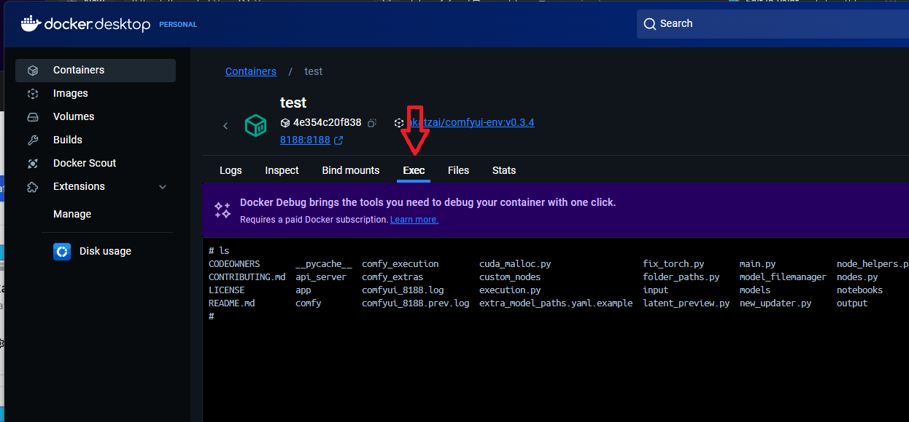

### Installing Custom Nodes Manually

- You can manually install custom nodes using “git clone” by using the “exec” feature of docker.
- Click the settings button on the environment you’d like to install nodes in, and find the “container name” in the About section.
- In docker desktop find a running container with the matching container name.
    
    
    
- After clicking on the container in docker desktop, navigate to the “exec” tab:
    
    
    
- In the terminal you can run commands that will execute within the running container.
- Navigate to custom nodes directory by inputting the command:

```
cd /app/ComfyUI/custom_nodes
```

- Then run the following commands, replacing <custom_node_repo> with the URL of the github custom node repo you’d like to install (e.g. https://github.com/akatz-ai/ComfyUI-AKatz-Nodes):

```
 git clone <custom_node_repo>
 cd <custom_node_directory>/
 pip install -r requirements.txt
```