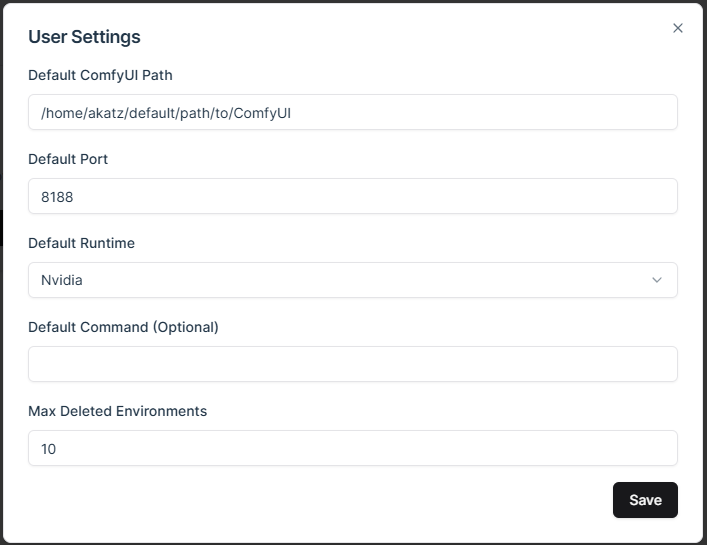

# Usage Overview

> **Video Demo**
> <video controls>
> <source src="../assets/usageDemo_edit1.mp4" type="video/mp4">
> </video>

## **Manager Layout**

ComfyDock has two main sections:

1. **Settings Panel** (top)
2. **Environments Grid** (below)

---

## **Updating User Settings**

1. Open **Settings** tab.

2. Configure Defaults:
    - ComfyUI Path
    - Port
    - Runtime
    - Start command
3. Click **Save**.

---

## **Creating a New Environment**

> **Demo Video**
> <video controls>
> <source src="../assets/createEnv_edit1.mp4" type="video/mp4">
> </video>

1. Click **Create Environment**.

2. Fill out fields:
    - **Name**: Any text (emojis allowed).
    - **ComfyUI Release**: Specific version or “latest”.
        - Releases are based on versions of ComfyUI I have packaged into an image, not the “latest” actual comfyui release.
        - Pick “latest” to grab whatever the most recent image is, otherwise you can specify an older version.
        - See the list of available images on [dockerhub](https://hub.docker.com/repository/docker/akatzai/comfyui-env/general)
        - If you want to build the dockerfiles locally, you can download the files from the [docker repo here](https://github.com/ComfyDock/ComfyDock-Docker)
        - Local-built images can be specified by tag in the “Custom Docker Image” field.
    - **Custom Docker Image**: Optional Docker image URL.
    - **Path to ComfyUI**: A valid directory on your host machine.
        - This can be any valid path to a directory on your host machine that you have write and read permissions to:
        - e.g. “C:\Users\akatz\my\path\to\ComfyUI”
        - If you don’t have ComfyUI already installed at the provided location, you will be prompted to install it after hitting “create”
        - If you provide a path to a directory containing multiple “ComfyUI” folders, the code will select the first directory to use with the environment.
3. Select an **Environment Type** (Default, etc.).

    - If default is selected, the environment will attempt to “mount” the models, output, and input directories from your existing ComfyUI installation into the environment.
    - Mounted directories can be read and written to by the environment, anything not mounted from the host machine will not be accessible by the environment.
    - You can see how changing the Environment Type directly affects the Mount Config by expanding the Advanced Settings tab.
4. Click **Create**.
> **Note**: If you have not yet downloaded the selected ComfyUI release image, then you will be prompted to download it on create.

---

## **Advanced Options**

- **Runtime**: `NVIDIA` for GPU or `None` for CPU.
- **Command**: Extra flags for the ComfyUI startup command, e.g. `--fast` or `--lowvram`.
- **Port**: The web UI port.

### **Mount Config**

The Mount Config panel now provides granular control over how host directories interact with container paths, with four configurable columns per row:

### **Columns Explained**

1. **Override (Checkbox):**
    - **Checked:** Manually specify the exact host path. Useful for non-standard directory locations.
    - **Unchecked:** Automatically generates host path by combining your ComfyUI path with the selected container directory name (e.g., if ComfyUI path is `C:\ComfyUI` and container path is `models`, host path becomes `C:\ComfyUI\models`).
2. **Host Path:**
    - The physical directory on your machine that will be connected to the container.
    - Editable directly when Override is checked.
    - Grayed out and auto-generated when Override is unchecked.
3. **Container Path (Dropdown):**
    - Predefined container locations you can map to:
        - `/app/ComfyUI/models`
        - `/app/ComfyUI/output`
        - `/app/ComfyUI/input`
        - `/app/ComfyUI/custom_nodes`
        - `/app/ComfyUI/user`
4. **Mount Action:**
    - **Mount:** Creates live sync between host and container directories (changes reflect immediately in both)
    - **Copy:** Creates a one-time snapshot copy from host to container at environment creation

### **Key Behaviors**

- Changing any Mount Config setting automatically switches Environment Type to "Custom"
- Add new mappings with **Add Directory** button
- Delete mappings using the ❌ icon on each row
- Container paths must be absolute paths starting with `/`
- Host paths follow OS conventions (Windows: `C:\path`, Linux/macOS: `/path`)

### **Mounting vs. Copying (Updated)**

**When to Use Mount:**

- Frequently updated resources (models, input/output folders)
- Shared assets between environments
- Development/testing scenarios needing real-time changes

**When to Use Copy:**

- Creating immutable snapshots for reproducibility
- Archiving specific workflow versions
- Sharing environments with bundled dependencies
- Sensitive data that shouldn't persist in host directories

### **Important Notes:**

- Copied directories become container-only - changes in host won't affect them
- Mounted custom_nodes directories trigger automatic dependency installation
- Read-only mounts (available via advanced settings) prevent accidental container modifications

---
